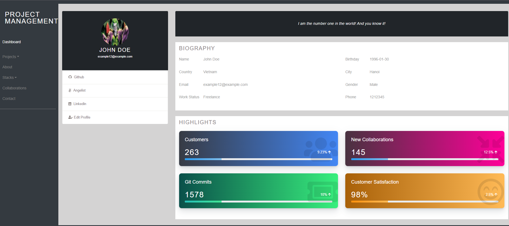
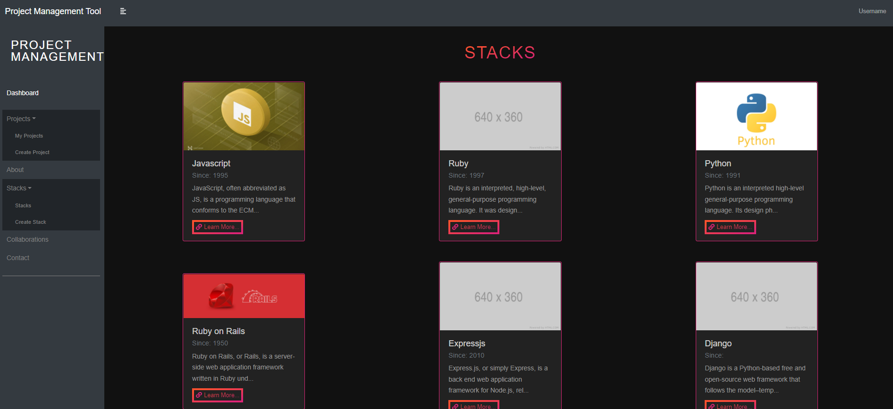

# 🚀 ProjectZen – MERN Project Management Tool

ProjectZen is a full-stack project management application built with the MERN stack (MongoDB, Express, React, Node.js). It helps teams manage tasks, deadlines, and progress with a clean, easy-to-use interface.

---

## 📌 Features

- 🗂️ Create & manage projects and tasks
- ✅ Mark tasks as complete/incomplete
- 🔒 User authentication with JWT
- 📆 Set deadlines and priorities
- 📊 Dashboard with project overview
- 🧠 Easy-to-use, responsive UI

---

## 🛠️ Tech Stack

- **Frontend**: React.js, Axios, Bootstrap/CSS
- **Backend**: Node.js, Express.js
- **Database**: MongoDB (via Mongoose)
- **Authentication**: J

---

## 🚀 Getting Started

### 📥 Clone the Repo

```bash

git clone https://github.com/shobhit0216/ProjectZen.git
cd ProjectZen


Dashboard:
[screenshot](./assets/screenshot.png)





